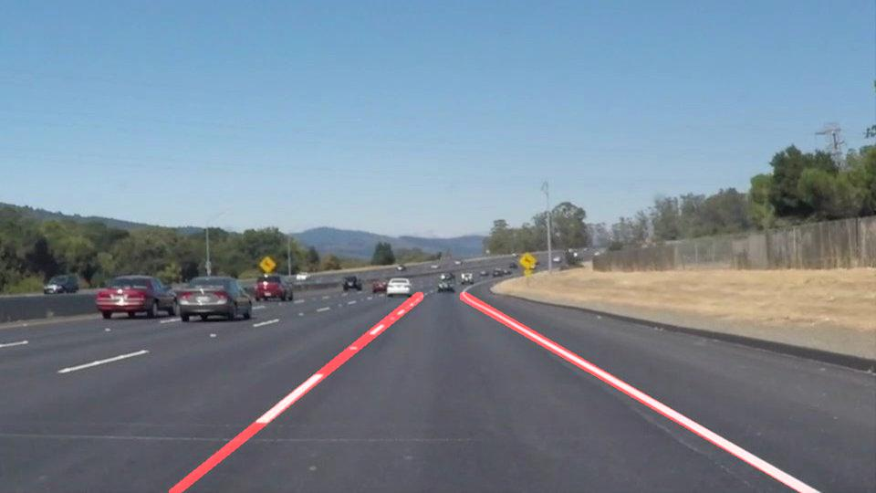

# **Finding Lane Lines on the Road** 

When we drive, we use our eyes to decide where to go. The lines on the road that show us where the lanes are act as our constant reference for where to steer the vehicle. Naturally, one of the first things we would like to do in developing a self-driving car is to automatically detect lane lines using an algorithm.

In this project lane lines are detected in images using Python and OpenCV. OpenCV means "Open-Source Computer Vision", which is a package that has many useful tools for analyzing images.

The original repository is part of the [Udacity - Self-Driving Car NanoDegree](http://www.udacity.com/drive) program and can be found on [GitHub](https://github.com/udacity/CarND-LaneLines-P1) .

This is one possible solution of the first project of the NanoDegree program and contains:
- Jupyter [notebook](P1.ipynb) with the implementation
- [Writeup](Writeup.md) explaining the solution
- Various Input/output images and videos of roads
