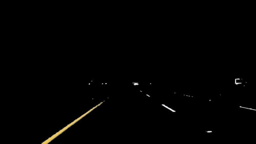

# Finding Lane Lines on the Road 

## Project goals

The goals / steps of this project are the following:
* Make a pipeline that finds lane lines on the road
* Reflect on your work in a written report

The pipeline implementation is contained in Jupyter notebook [P1](P1.ipynb) and available as [HTML export](P1.html).

## Reflection

### Pipeline description

My initial pipeline consists of 5 steps:
 1. Convert image into grayscale
 2. Apply Gaussian smoothing / blur 
 3. Find edged using Canny edge detection
 4. Apply filter mask for region of interest
 5. Identify lane lines using Hough transformation
 
The pipeline is implemented in function `process_image`. Parameter optimization is done manually using debug outputs after each step of the pipeline. That way images and videos could be analyzed for each individual step of the pipeline.

After Canny edge detection, white and yellow lane lines can be clearly identified in the image besides many other objects. These other objects are filtered out by applying a trapezoid mask on the region of interest, i.e. the road in front of the car. In below image the lines in the region of interest are highlighted compared to the filtered grayed-out area:

Hough transformation is applied to identify potential edges of the lane lines. A gradient and bias is calculated for each edge. These edges are grouped into left and right lanes based on the image position and gradient of the line. Lane lines are typically not horizontal. They range from a minimum absolute gradient greater than zero to infinity for vertical lines, i.e. when the car is driving centered on the lane. Both, position and gradient filters, are applied in my function to further eliminate unreasonable edges.

In order to not deal with infinity gradients for vertical lines, x and y coordinates are flipped. Then for left and right lane groups, the gradient and bias of corresponding edges is averaged, respectively. A weighted average is used with the edge length as weight factor.

Finally, based on the mean gradient and bias, single left and right lane lines are extrapolated from the bottom of the image to the horizon and drawn on top of the input image:

 
### Potential shortcomings of the pipeline

There is one significant shortcoming of described pipeline: If the road surface is not homogeneous and contains sharp color gradients besides those of the lane lines, then the lane lines cannot be clearly separated and averaging of lane gradient and bias will fail. One solution can be color filtering, that only the possible color ranges of the lanes (white and yellow) are contained in the image before edge detection is applied.

Other shortcomings can be susceptibility to changing light conditions, other disturbing line markings in the region of interest, sharp curvature of the lanes or offsets in the camera image. As a result lane lines might not be detected at all or have wrong gradient or position in the image.

### Improvements of the pipeline

Adding color filtering to the pipeline as an initial step before applying Canny edge detection will significantly improve the robustness of the algorithm.

An additional helper function `filter_color` is added to the pipeline as an initial processing step. It applies color masks for white and yellow colors using the `inRange` function of OpenCV. White color can be filtered well in the RGB color space, whereas yellow color is better filtered in the HSV color space. Both color masks are combined by an `or` logic and applied to the input image:

